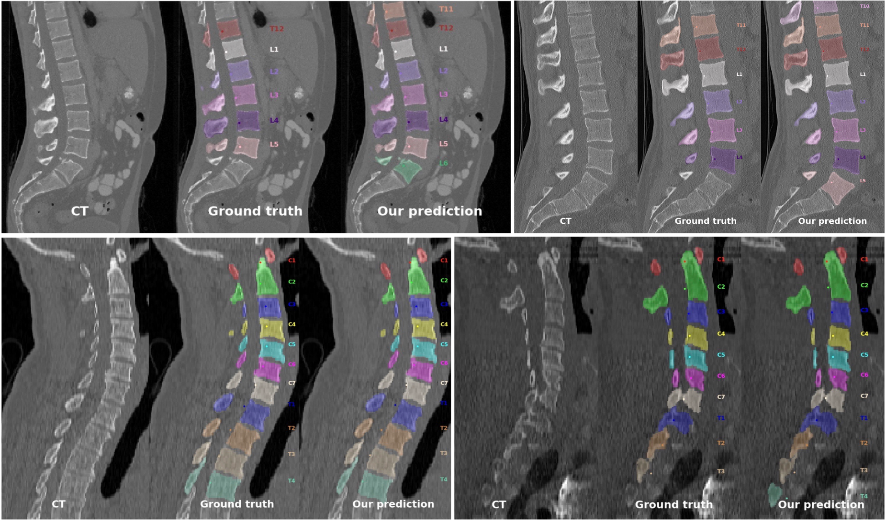

# Vertebrae segmentation

This is the associated repository of the work 

**Vertebrae localization, segmentation and identification using a graph optimization and an anatomic consistency cycle, 2022.**

Pre-print: [http://arxiv.org/abs/2110.12177](http://arxiv.org/abs/2110.12177).

It includes the proposed pipeline to segment and label vertebrae from CT images with arbitrary field of view. 
To test the pipeline, please follow the steps below.



## Download the repository

```bash
git clone https://gitlab.inria.fr/spine/vertebrae_segmentation.git
```

## Hardware requirements

A graphics card (GPU) with minimum 3Gb is needed. 

The code has been tested on: Ubuntu 18.04, RTX  Quadro 4000 8Gb, cuda 10.1

## Set up a python environment

If you use [anaconda or miniconda](https://docs.anaconda.com/anaconda/install/index.html), run the following to create and activate a virtual environment:

```bash
conda env create -f environment.yml
conda activate verse20
```

If you use another virtual environment (virtualenv, pyenv, ...), create it and activate it.

Then install the requirements,

```bash
pip install -r requirements.txt
```

Now you should have all the required dependencies.

## Run a demo

To test that your code is operational we provide a sample demo. You can run it 

```bash
python test.py -D sample/verse815_CT-iso.nii.gz -S sample/ -F
```

The output is going to be in the "sample" folder. You can evaluate and visualize the result by running

```bash
jupyter notebook evaluate.ipynb
```

The result should be consistent with 

<!-- { width=50% } -->


# Reproduce VerSe20 results

The released model was trained on the [VerSe20 challenge](https://verse2020.grand-challenge.org/) public training set. 
To reproduce the results of the paper you will need to downlad the VerSe20 public and hidden testset from [Github](https://github.com/anjany/verse). 

More details about the dataset can be found in the publication [Sekuboyina A et al., VerSe: A Vertebrae Labelling and Segmentation Benchmark for Multi-detector CT Images, 2021.](https://doi.org/10.1016/j.media.2021.102166)

## Run the model on VerSe20 testset

The *challenge data structure* you downloaded should be the one below:

```
../verse20_miccai_challenge
	01_training
	  ...
	02_validation (public testset)
	  GL017
		GL017_CT_ax.nii.gz
		GL017_CT_ax_seg.nii.gz
		GL017_CT_ax_iso-ctd.json
		GL017_CT_ax.png
	  ...
	03_test (hidden testset)
	  ...
```

Please be careful, VerSe authors also release a *Sub-directory-based arrangement for each patient* which is different and won't work with the provided code.


To process the public testset, run

```bash
python test_verse.py -D <path to folder>/02_validation
```

To process the hidden testset, run

```bash
python test_verse.py -D <path to folder>/03_test
```

The output for each input CT scan is a multi-label segmentation mask and a json file with labels and centroid coordinates.

You can specify the save folder with the -S option

```bash
python test_verse.py -D <path to folder>/02_validation -S <path to output folder>
```

The default <path to output folder> is ``results/``.

## Evaluating individual scans

To process one scan instead of the whole dataset, you can use the -V option and
provide the scan ID (eg. GL017):

```bash
python test_verse.py -D <path to folder>/02_validation -V GL017
```

# Run on other CT scans

Currently only nifti files are accepted. You can use third party softwares to convert from your format to nifti.
For instance [ITK-SNAP](http://www.itksnap.org/pmwiki/pmwiki.php), open main image -> save image -> choose file format "NiFTI".

Please make sure that the patient orientation (RAI code) is properly filled in.
Then run

```bash
python test.py -D <path to your nifti file> -S <path to output folder>
```


## Contact

For any questions about the paper and repository, please contact [Di Meng](mailto:di.meng@inria.fr) and [Sergi Pujades](mailto:sergi.pujades-rocamora@inria.fr).

## Citing 

If you use the released models or code, please cite both

1. **Meng D et al.,Vertebrae localization, segmentation and identification using a graph optimization and an anatomic consistency cycle, 2022.** [http://arxiv.org/abs/2110.12177](http://arxiv.org/abs/2110.12177)
2. **Sekuboyina A et al., VerSe: A Vertebrae Labelling and Segmentation Benchmark for Multi-detector CT Images, 2021.** [https://doi.org/10.1016/j.media.2021.102166](https://doi.org/10.1016/j.media.2021.102166)


## License

The trained model and the code is provided under the [CC BY-NC-SA 4.0](https://creativecommons.org/licenses/by-nc-sa/4.0/legalcode).


## Commercial licensing opportunities

For commercial uses of the Data & Software, please send an email to [Edmond Boyer](mailto:edmond.boyer@inria.fr) and [Sergi Pujades](mailto:sergi.pujades-rocamora@inria.fr).
